# Chinese to Begin

###### Code Institute / Full Stack Frameworks With Django

ChiBegin is a Chinese Institute website built by using Pythons Django framework and hosted by using Heroku.

This is a language learning institute website that promote their Chinese teaching to the language learner. The interested one can register the course by purchasing the course at the website. They can view their order history at their own profile page. They can also contacting the website admin to have more queries on the course or the institute itself.

The deployed website can be found at here: **[CHIBegin](https://chinese-to-begin.herokuapp.com/)**

## Table Of Contents

1. [UX](#ux)
	- [User Stories](#user-stories)
	- [Design](#design)
	- [Wireframes](#wireframes)

2. [Features](#features)
	- [Existing Features](#existing-features)
	- [Future Features](#future-features)

3. [Technologies Used](#technologies-used)
	- [Languages](#languages)
	- [Frameworks & Libraries](#frameworks-and-libraries)
	- [Tools](#tools)

4. [Testing](#testing)

5. [Deployment](#deployment)
	- [Local Deployment](#local-deployment)
    - [Running Code in Local](#running-code-in-local)
	- [Deployment To Heroku](#deployment-to-heroku)

6. [Credits](#credits)
	- [Content](#content)
	- [Media](#media)
    - [Code](#code)
	- [Acknowledgements](#acknowledgements)

## UX

This website can be split into 2 sections:
1. **The normal user section** - They can navigate to normal user section only, such as to view the information at the website, to register a course, to manage their own profile, to view their order history, and to contact the website admin.
2. **The super user section** - They can navigate beyond than a normal user, such as to manage the store, add, update and delete the course.

The design of the website is more on simplistic yet appeared to be eye catchy and easy to be navigated. The navigation bar is sticked on top so that the user could easily navigate despite of the scroll location. Back to top button also provided to ease the user back to the top of certain page. The used of colors are random but suit to the theme of the website.

### User Stories

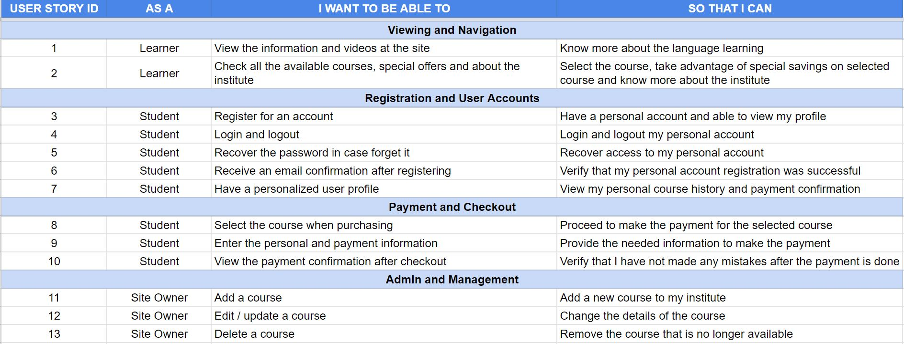

### Design

#### Application Framework
Django framework is used in the website.

#### Database
The sqlite3 database was used during the development. The PostgreSQL database was used when the website deployed to Heroku.

Besides the normal e-commerce website models, such as the model of Store, UserProfile, Order and OrderLineItem, I have added 2 more models, that are Condition and Contact for future features. Condition model was added to indicate the existing or archive courses in the store so we can only show the existing courses to the user. While the Contact model was added to let the user to contact the website admin for any enquiry on the courses.

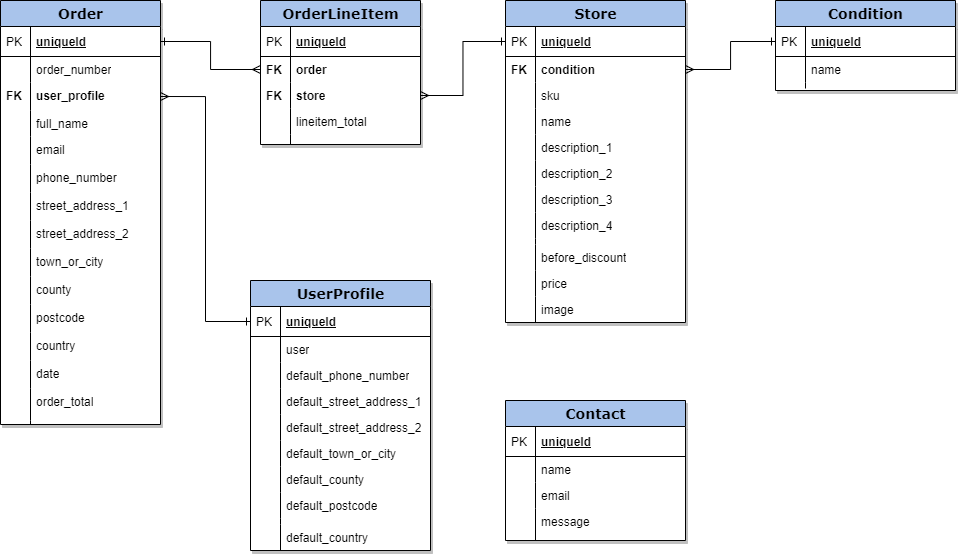

#### CSS Framework
Bootstrap v4.5 framwork was used in the website.

#### Icon
Font Awesome 5 was used throughout the project, across all the pages.

#### Typography
Only 1 type of font is used throughout the website: **[Merriweather](https://fonts.google.com/specimen/Merriweather?query=Merriweather)**

### Wireframes

The wireframes were created at the beginning of the project by using **[Balsamiq](https://balsamiq.com/)**. The final website are similar to the created wireframes, yet do differ as adding some functionalities and designs to all the pages.

#### Desktop & Tablet View
##### [Home] | [Tips of Learning] | [Store] | [About] | [My Account]
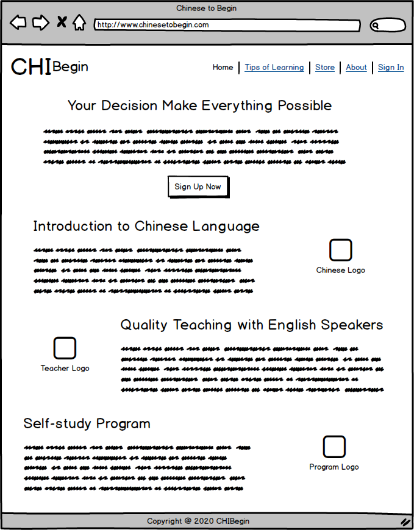&nbsp;
&nbsp;
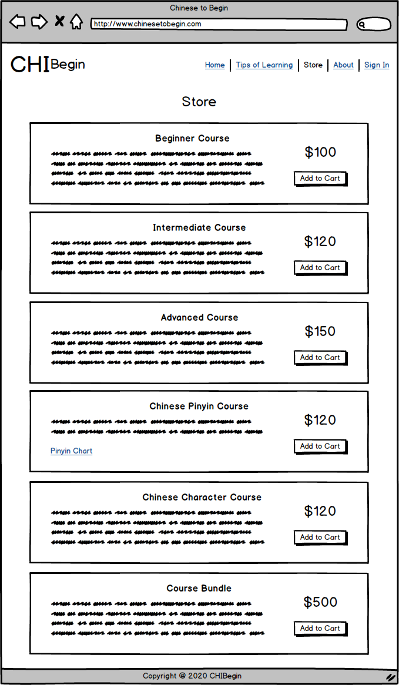&nbsp;
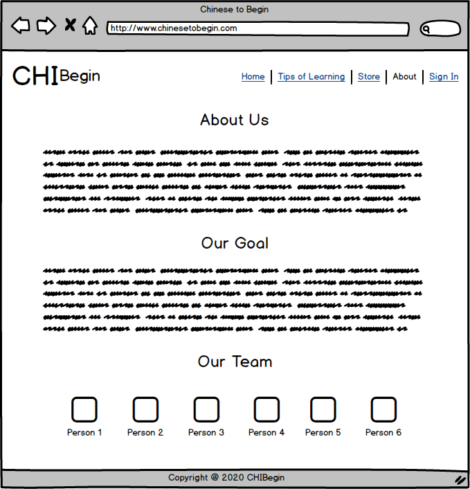&nbsp;
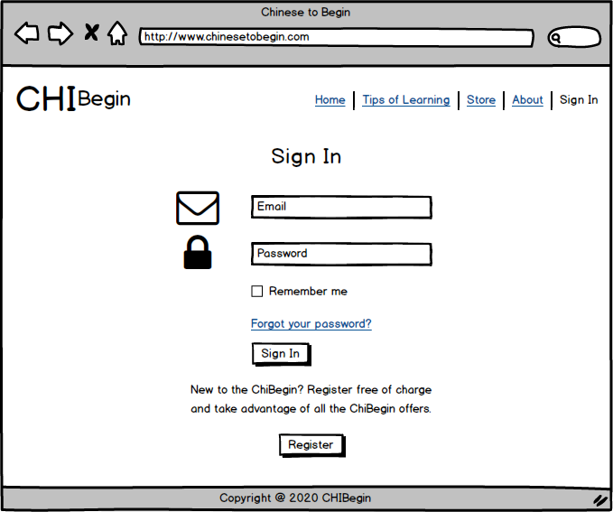

#### Mobile View
##### [Home] | [Tips of Learning] | [Store] | [About] | [My Account]
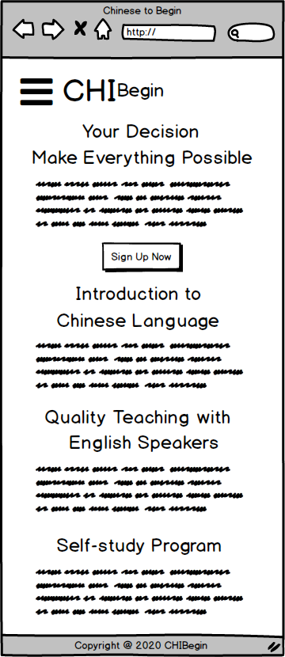&nbsp;
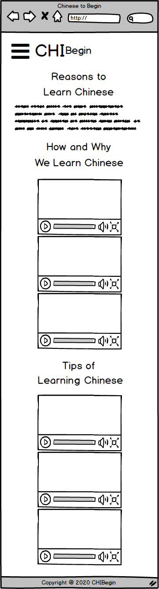&nbsp;
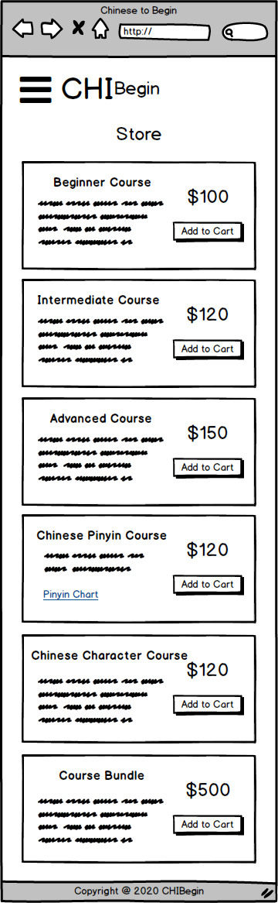&nbsp;
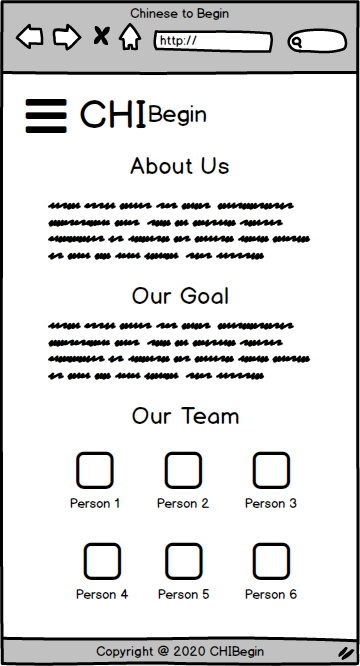&nbsp;
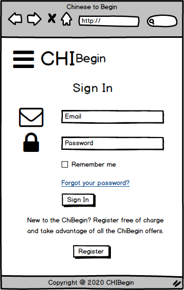

## Features

### Existing Features
#### Home
This is the introduction page at the website and is designed to give the users an insight on what to expect once they have registered the course. There is a Sign Up Now button that will link the user directly to all the available courses at the store.

#### Contact
A contact form is available at the bottom of the Home page, in order to to let the users to contact the website admin for any enquiry. The website admin can view all the details from the contact form at the admin backend page.

#### Tips of Learning
This is the tips of Chinese language learning page that given in YouTube video format, which consisted majority on how the foreigners interested in Chinese language and how they learn Chinese. The purpose of this page also to give the encouragement to the non-Chinese speaker to learn Chinese.

#### Store
The store page shows the available courses in this institute to be registered by the users. Once the user selected on the desired course, the select button will link the user to the course detail page to proceed to checkout. No shopping cart is required as only one course to be purchased at a time.

Besides, the super user will be able to edit and delete a course in this page if something need to be changed on a certain course.

#### Checkout with Stripe Payment Transaction
At the checkout page, if the user has not registered as a new user, they will need to fill out the user's detail form before completing the order. If the user has a registered profile, their information will be saved upon the checkout if the option is chosen.

The user will need to fill out the details of their payment card in order to create the Stripe payment transaction at the backend. If this field is not being filled correctly, an error message will be shown so the user can have it corrected. A successful payment will link the user to a course registration confirmation page, together with the order details.

#### About
The about page consisted of about the institute, the goal and the present team that have raised the online business teaching.

#### New User Registration
The users can register an account from the website. No restriction given on who to register an account. The user must provide unique username and email address as it will be checked against the existing entries upon the registration. A unique password, not to be same as the username or email address will be needed, which must be entered twice to check if it is inputted correctly.

If each of the fields are not being filled correctly, or same data being detected, the website will give an error message so they can have it corrected.

#### User Login
The user login page requires a username and password to proceed. There is a link to reset the password for who have forgotten the password. Once the user click on 'Forgot Password?' link, the website will request them to provide an email address that has been registered to the institute. If a match is found, they will receive an email with a link that allowing them to create a new password.

#### User Profile
The users are encouraged to register an account at the website as their information will be saved for further used especially when dealing with the course registration. Furthermore, any of the orders made will be recorded in their own profile page. This will ease the user to check back their previous orders.

#### Store Management
The store owner are able to add a new course at store management page.

#### Admin Backend Management
This is the Django admin page that been customized in order to ease the admin managament. The admin will be able to see the further details at this section, such as the details of the registered users plus their email address, all the orders, courses and the contact detail for any of the enquiries.

#### Navigation Bar
The navigation bar allows the user to navigate between the different pages at the website.

#### Back to Top Button
The Back to Top button allows the user to move to the top of the page whenever they scrolling on a certain page.

#### Footer
The footer contain a short line of text for copyright notice for Chinese to Begin.

### Future Features
#### Archive the Old Course
There will be happened the course not available after some while. Thus, I have prepared a model named 'Condition' to record the course as existing or archiving. It will be my future feature to only show the existing course at the Store page.

#### Link the Contact Form to Admin Email
The function of the current contact form only to record the details sent by the user in the admin backend management page. I planned to link the contact form to the admin email in the future so they can reply the user directly from the email itself.

#### User Reviews
There will be the needs of a user review section in the website. This section can serve as an encouragement to the user on how the other registered student feel after gone through the course.

### Technologies Used

#### Languages
- [HTML](https://en.wikipedia.org/wiki/HTML) for the frontend development.
- [CSS](https://en.wikipedia.org/wiki/Cascading_Style_Sheets) used to style the HTML.
- [JavaScript](https://en.wikipedia.org/wiki/JavaScript) for the dynamic programming on user interactions.
- [Python3](https://www.python.org/download/releases/3.0/) used for all the backend development.

#### Frameworks and Libraries
- [Django](https://www.djangoproject.com/) is used to implement the high-level Python framework for the development of the backend.
- [Bootstrap v4.5](https://getbootstrap.com/docs/4.5/getting-started/introduction/) is used to provide the CSS framework. 
- [FontAwesome](https://fontawesome.com/) is used to provide the icons throughout the website.
- [GoogleFonts](https://fonts.google.com/) is used to provide the font styling to the website.
- [Jinja](https://jinja.palletsprojects.com/en/2.11.x/) is used as a template language to implement the logic at the frontend.
- [JQuery](https://jquery.com/) is used with the JavaScript for the DOM manipulation.

#### Tools
- [Git](https://git-scm.com/) is used for version control.
- [GitHub](https://github.com/) is used store and manage the repository of this project.
- [GitPod](https://www.gitpod.io/) is used to create this project.
- [Heroku](https://heroku.com/) is used to host the deployed version of the website.
- [AWS S3 Buckets](https://aws.amazon.com/s3/) is used to host the static and media folders.
- [SQlite3](https://www.sqlite.org/index.html) is the database provided by Django during the development.
- [PostgreSQL](https://www.postgresql.org/) is the database that works on Heroku after the deployment.
- [Stripe](https://stripe.com/) is used to handle the online payment transaction.
- [Gmail](https://mail.google.com/) is used to send the automatic generated email to a user upon new account registration.
- [Balsamiq](https://balsamiq.com/) is used to used to design and create the wireframes before starting this project.
- [Draw.io](https://drawio-app.com/) is used to design my relational database diagram. 
- [Flaticon](https://www.flaticon.com/) is used to get the image for the website and the icon at the browser tab in .png format.
- [Onlineconvertfree](https://onlineconvertfree.com/convert-format/png-to-ico/) is used to convert the image from .png to .ico as to use the icon at the browser tab.

## Testing

Throughout the development of this project, manual testing is implemented. The testing is simple yet effective to test on each of the function, link and the button. In the testing process, I was able to identify every issue before the deployment. This testing allow me to gone through every user story by the step of registration or order.

	
All the testing of this project can be found by clicking here

### Code Validation

- [W3C Markup Validation](https://validator.w3.org/) is used to validate the code for HTML files.
    - Some warnings and errors were reported but they are related to the jinja code and Script usage.
- [W3C CSS Validation](https://jigsaw.w3.org/css-validator/) is used to validate the code for CSS files.
    - Some warnings and errors were reported but they are related to the detection of `-webkit-user-select`, `-moz-user-select` and `-ms-user-select` as an unknown vendor extension, and use the same color at the allauth form.
- [JSHint](https://jshint.com/) is used to validate the code for JS files.
    - There are template literal syntax warnings related to the use of syntax only available in ES6.
    - Warning on 'let' is only available in ES6.

### Responsiveness

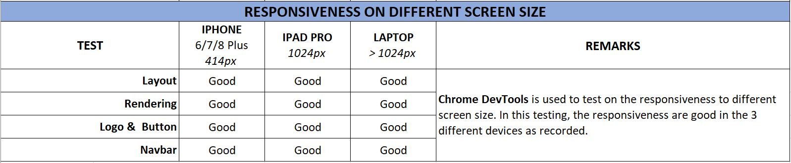

### Browser Compatibility

### User Stories

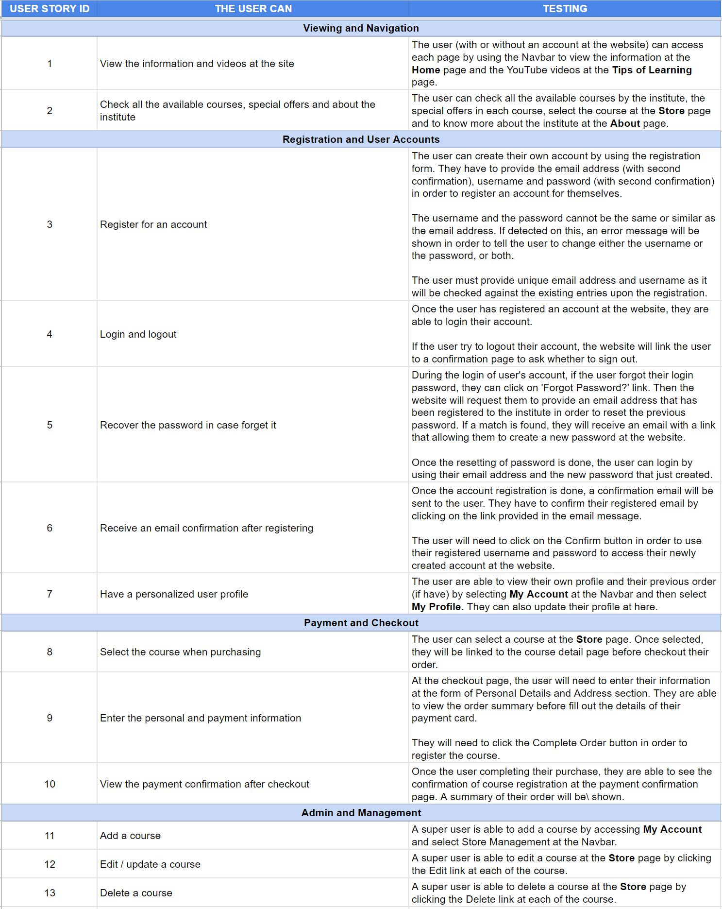

### Known Issues
However, there are warnings or issues detected which related to the displaying of information about deprecations, breaking changes and other potential problems. This might caused by the YouTube links provided at the HTML page.

## Deployment

### Local Deployment
In order to deploy the project locally by using GitPod, the web browser such as Google Chrome is suggested to use the GitPod chrome extension.
1. Add the GitPod extension at Chrome:
    - Go to [GitPod Chrome Extension](https://chrome.google.com/webstore/detail/gitpod-dev-environments-i/dodmmooeoklaejobgleioelladacbeki).
    - Click on `Add to Chrome`, then click on `Add to extension`.
2. Open the project repository by using GitPod:
    - Go to [chinese_to_begin](https://github.com/kongteckmee/chinese_to_begin) repository.
    - If the GitPod chrome extension is successfully added, a green `Gitpod` button will be shown at the top right corner, next to the `Code` button. Click on the `Gitpod` button.
    - This will allow you to edit the code that originally at GitHub in GitPod.
3. Add the environment variables at the **Settings** at GitPod workspace:

Enviroment Variables|Value
---|---
EMAIL_HOST_PASS|`<EMAIL_HOST_PASS>`
EMAIL_HOST_USER|`<EMAIL_HOST_USER>`
SECRET_KEY|`<SECRET_KEY>`
STRIPE_PUBLIC_KEY|`<STRIPE_PUBLIC_KEY>`
STRIPE_SECRET_KEY|`<STRIPE_SECRET_KEY>`

4. SQlite3 is the local database for this Django project.
5. All the necessary dependencies that listed in **requirements.txt** file need to be downloaded in order to run this project, by running the command at the terminal `pip3 install -r requirements.txt`
6. Create a local development server by running the command `python3 manage.py runserver`.

### Running Code in Local
In order to clone the chinese-to-begin repository to local, follow the steps below:
1. Navigate to [chinese_to_begin](https://github.com/kongteckmee/chinese_to_begin) repository.
2. Click on green `Code` button on top right corner.
3. In the **Clone with HTTPS** section, copy the clone URL for this repository.
4. Go to GitPod Online IDE and open the terminal.
5. Type the following `git clone https://github.com/kongteckmee/chinese_to_begin.git`.
6. Press Enter to create the local repository.
7. Create an `env.py` and import to the `settings.py` file to set the credentials for the environment variables in the local workspace.
8. Install the requirements.txt by running this command `pip3 install -r requirements.txt` in the terminal.
9. Launch the project by running this command `python3 manage.py runserver`.

### Deployment to Heroku
The website is deployed at [Heroku](https://dashboard.heroku.com/apps/chinese-to-begin). These steps are applied to deploy this project:
1. Install **gunicorn** package by using `pip3 install gunicorn` to run the website at Heroku.
2. Install **pycopg2** by using `pip3 install psycopg2` to connect to PostgreSQL.
3. Create **requirements.txt** file by using `pip3 freeze --local > requirements.txt`.
4. Create a new application at Heroku:
    - Sign up for a new Heroku account.
    - Click on `New` and `Create new app` to create a new application.
    - Set the name of the application, select your region and click on create app.
5. Install PostgreSQL by using `heroku addons:create heroku-postgresql:hobby-dev`.
6. Create **Procfile** at the root directory by added the content as `web: gunicorn chinese_to_begin.wsgi:application`.
7. Add the environment variables at the **Settings**, under **Config Vars**:

Enviroment Variables|Value
---|---
AWS_ACCESS_KEY_ID|`<AWS_ACCESS_KEY_ID>`
AWS_SECRET_ACCESS_KEY|`<AWS_SECRET_ACCESS_KEY>`
DATABASE_URL|`<DATABASE_URL>`
EMAIL_HOST_PASS|`<EMAIL_HOST_PASS>`
EMAIL_HOST_USER|`<EMAIL_HOST_USER>`
SECRET_KEY|`<SECRET_KEY>`
STRIPE_PUBLIC_KEY|`<STRIPE_PUBLIC_KEY>`
STRIPE_SECRET_KEY|`<STRIPE_SECRET_KEY>`
USE_AWS|`<True>`

8. At **Deploy** tab, at the **Deployment method** section, connect Heroku by choosing **Connect GitHub** and **Enable Automatic Deployment** from the GitHub master branch to allow all new committed lines to be automatically deployed to the heroku application.

## Credits

### Content
- For the concept of this website, it is from my previous Chinese teaching idea and I got inspired by [Yoyo Chinese](https://yoyochinese.com/landing) that took me to design the website and put the majority content in a similar way, yet it is still in my own styling.
- For the content related to 'Introduction to Chinese Language', I have used the information from [Chinasage](https://www.chinasage.info/language.htm) as they are giving a good introduction to Chinese language in a detail way.
- For the content related to 'Reason to Learn Chinese', I have used the information from [Lindsay Does Languages Video](https://www.youtube.com/watch?v=cS1UaQvs-3E) that shared a lot of experience in her Chinese learning.

### Media
- All the images from the 'Home', 'Tips of Learning' and 'Store' page can be found on [Flaticon](https://www.flaticon.com/).
- All the team profile picture are from [Organic Headshots](https://www.organicheadshots.com/testimonials.html).
- All the icons are from [Font Awesome](https://fontawesome.com/).
- All the tips of learning from the foreigners are from [YouTube](https://www.youtube.com/) on their own YouTube subscription page.

### Code
- I referred majority of codes from [Project - Boutique Ado](https://courses.codeinstitute.net/courses/course-v1:CodeInstitute+FSF_102+Q1_2020/courseware/4201818c00aa4ba3a0dae243725f6e32/d3188bf68530497aa5fba55d07a9d7d7/?activate_block_id=block-v1%3ACodeInstitute%2BFSF_102%2BQ1_2020%2Btype%40sequential%2Bblock%40d3188bf68530497aa5fba55d07a9d7d7) from the lessons of [Code Institute](https://codeinstitute.net/) as I think that is the standard of an e-commerce website should have.
- The rest of codes, I have modified it myself due to the different design from Boutique Ado.
- I referred some of the codes from [Stack Overflow](https://stackoverflow.com/) and [Slack Community](https://slack.com/intl/en-gb/) to fix the issues during the development.

### Acknowledgements
- Praise God that He is giving me the chance to start and also to complete this course.
- Special thanks to [Dick Vlaanderen](https://github.com/dickvla), my mentor from Code Institute, for his patience and his valuable advice throughout the course.
- Thanks to the entire tutor support team at Code Institute for their guidance and great feedback.

